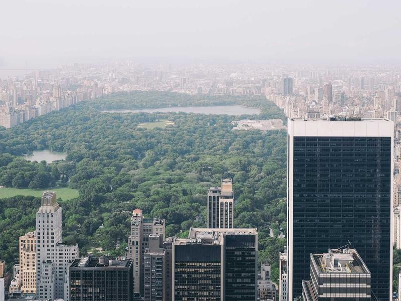

# 探索自然之美

欢迎来到这个小小的图集，这里记录了一些令人心旷神怡的瞬间。

## 第一章：远方的风景

在繁忙的都市生活中，我们常常忘记了抬头看看天空。下面这张照片捕捉了远方的风景，让人不禁想放下手头的工作，背上行囊出发。

## 第二章：静谧的时光

有时候，最美的画面并不在远方，而就在我们身边的一草一木之中。放慢脚步，你会发现生活中处处藏着惊喜。

## 第三章：无限可能

每一张照片都是一个故事的开始，每一个画面都承载着无限的可能。希望这些图片能给你带来一丝灵感和宁静。

---

*感谢浏览，愿你的生活如这些风景般美好。*
